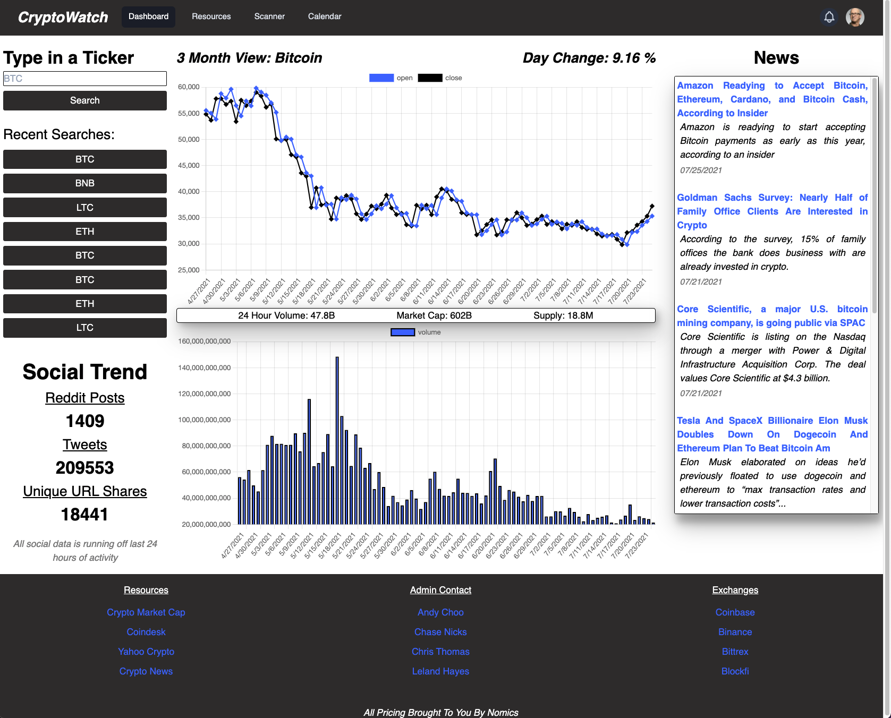

# CryptoWatch

# Description

A crypto application that gives users useful insight of whats going on in the market, able to see a 3 month view of price and volume action, current news, and how many posts have been made to said crypto on various social platforms.

# Technologies Used

* Tailwind
* jQuery
* Charts.Js

API's

* Lunacrush
* Nomics

# Application Screenshot

# Github Pages Link 

https://copernichris.github.io/CryptoWatch/